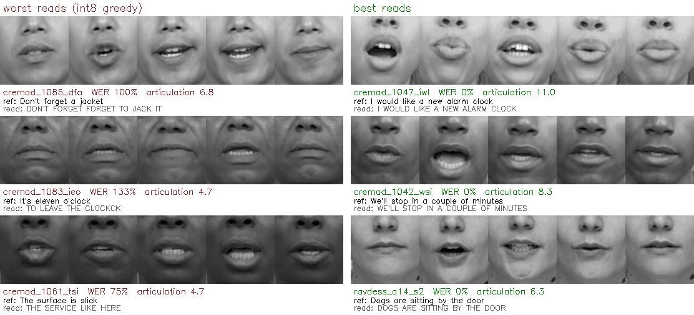

# Eval v2: unseen faces (2026-10-04)

**Session 3 (frontend/app-gaps) uses this set** for the app eval: six fake-camera parts in the same format
as `eval20.y4m`, plus a scorer that breaks the app's errors down by face group (see "Use it").

Everything lives in the private HF dataset `eschmechel/stormhacks-lipread-eval`:
- `raw_eval_v2/`: clips + `.txt`, `manifest.json`, `annotations.json`, `ATTRIBUTION.txt`, `report/` (all results, figures)
- `app_eval_v2/`: `partN/eval20.y4m` + `eval20_refs.json`, `index.json`

Code: `ml/scripts/build_eval_v2.py` (rebuild / add sources), `eval_v2_report.py` (model WER by group),
`make_eval_video_v2.py` and `score_app_v2.py` (app eval). Dataset survey and what needs your clicks:
`eval-v2-datasets.md`.

## Summary
- **144 clips, 62 people, 1,103 words, 29 sentences**, none in the model's training data (LRS2, LRS3,
  VoxCeleb2, AVSpeech), none from raw_eval (the app was tuned on those). v1 was 20 clips / 122 words.
- **Model alone: int8 greedy 41.3% [32.4, 48.2], pod beam 35.0% [27.4, 41.8]** (95% CI, people resampled).
  Much higher than v1 (25.4% / 29.5%) because v2 adds long TIMIT sentences and angled cameras.
- **What fails, in order:** the sentence (from 0% to over 90% WER per sentence); little lip movement; head pose (camera
  below +22 points, 60° turn +8, 30° turn +3–5 on the same takes). Face size, brightness and crop contrast
  show no effect once you compare within a source.
- **Skin tone:** no significant gap. Beam leans toward one (darker-skinned speakers 1.36× their expected
  errors [0.84, 1.80]; lighter-skinned 0.89× [0.74, 1.08]); greedy barely does (1.13× vs 0.97×). The set
  is too small to settle it; Casual Conversations (gated, #1 in the survey) is built for that question.
- No clip in the open sources is dim-lit, so lighting is untested; same fix.

## What's in it
| source | clips | people | words | sentences | video | people mix | references |
|---|---|---|---|---|---|---|---|
| CREMA-D | 60 | 30 | 337 | 12 everyday lines | 480×360, 30 fps, green screen | ages 22–62; 13 African American, 10 Caucasian, 6 Asian, 1 not stated; 13 F | script, Whisper-confirmed |
| RAVDESS | 8 | 8 | 48 | 2 | 1280×720, 30 fps, white studio | 4 F, 4 M | script, Whisper-confirmed |
| VidTIMIT | 28 | 16 | 292 | 2 (TIMIT sa1/sa2) | 512×384, 25 fps, office | 8 F, 8 M, Australian accents | script, Whisper-confirmed (8 one-word near-matches) |
| MEAD (`mead/`) | 48 | 8 | 426 | 13 TIMIT-style | 1920×1080, 30 fps, studio, **same take from 3 cameras** | 4 F, 4 M; 5 darker-skinned | MEAD's published list, Whisper-confirmed |

- Picks are seeded and stratified (CREMA-D by race × sex × age band; sentences rotated across people so
  groups get a similar mix). Neutral emotion only. Clips are H.264, constant source frame rate, no audio.
- **Reference rule:** always a published script, and Whisper (small.en → medium.en → large-v3-turbo) has to
  hear it on the clip's own audio, word for word or with one substituted word ("near_match", 20 clips,
  flagged in the manifest). Anything else is dropped: a CREMA-D actor who said the line twice and 4
  VidTIMIT "dark suit" readings (at least two of those look like Whisper failing on the accent, so
  hard-to-hear speakers are slightly under-represented). Whisper on its own is not trusted: on MEAD two
  models agreeing were still wrong on 3 of 8 takes.
- **Measured per clip** (manifest `measured`, from the same BlazeFace detector the crop uses): eye distance in
  pixels (crop scale), yaw / roll / pitch, head movement, face brightness, side-lighting, cheek ITA°, and
  on the 88×88 crop itself contrast, mouth brightness and **articulation** (mean frame-to-frame change
  around the mouth).
- **Skin tone** is a by-eye label per person on coarse Monk bands (lighter 1–3, medium 4–6, darker 7–10),
  in the private `annotations.json`: 29 lighter, 15 medium, 18 darker. ITA from video was too skewed by
  green-screen spill and white balance to bin. CREMA-D's own race labels are reported separately.

## Results (model alone)
| | int8 greedy (speed mode, local ORT CPU) | pod beam 40 + LM (accuracy mode, `/lipread/crops`) |
|---|---|---|
| **all 144 clips** | **41.3%** [32.4, 48.2] | **35.0%** [27.4, 41.8] |
| same, spelling-lenient (11 = eleven, to morrow = tomorrow, don't = do not) | 39.5% | 33.1% |
| CREMA-D | 13.4% [8.8, 19.0] | 9.2% [5.3, 13.6] |
| RAVDESS | 6.2% [0.0, 14.6] | 8.3% [0.0, 20.8] |
| VidTIMIT | 53.1% [42.0, 63.4] | 53.1% [43.1, 62.8] |
| MEAD (all cameras) | 59.2% [49.1, 70.5] | 46.0% [35.9, 58.8] |
| frontal clips only (112) | 34.2% [26.8, 41.3] | 30.2% [22.6, 37.6] |
| skin tone lighter / medium / darker | 36.0 / 46.9 / 42.7% | 29.9 / 39.0 / 37.3% |
| female / male | 44.1 / 38.5% | 37.4 / 32.7% |

Raw group rows above mix in source and sentence differences (most darker-skinned clips are MEAD, the
hardest source), so use the adjusted numbers below for causes. Strict scoring (bench.py's) is the
headline so it compares with every earlier number; lenient is in `report/`. Pod: the serving pod at
`qa5oi7o7g46n4q`, beam 40, CTC 0.1, LM 0.3, used read-only. Int8 ran in this cloud container (Xeon); on v1
raw-20 it reads one word differently from the laptop lock (26.2% vs 25.4%: int8 kernels differ by CPU, D41).

## Which faces fail, and why


*Five frames across each clip, as the model sees them (88×88 centre of the 96×96 crop). CREMA-D (ODbL /
DbCL) and RAVDESS (CC BY-NC-SA 4.0, Livingstone & Russo 2018). The two best CREMA-D reads open the mouth
wide (articulation 11.0 and 8.3), the worst move less (4.7–6.8). A tendency, not a rule: RAVDESS a14 reads
perfectly at 6.3.*

1. **The sentence decides most of it.** Shared sentences range (greedy) from 0% ("I wonder what this is about",
   "I think I have a doctor's appointment") to 67% ("She had your dark suit in greasy wash water all year",
   12 readers) and 94% ("The plaintiff in school desegregation cases"). Short, common phrases are easy;
   rare words (greasy, desegregation, marvelously) and lip-shape homophones (slick / like, suit / soup) are
   not. "The surface is slick" is the hardest CREMA-D line (55%). VidTIMIT's 53% is its two sentences
   (sa1 67%, sa2 42%). Compare app modes on the same parts, never across parts.
2. **Little lip movement.** Within a source, articulation is the one measure that predicts errors:
   Spearman ρ −0.38 (MEAD) and −0.35 (VidTIMIT) on greedy, −0.41 and −0.46 on beam (p < 0.05 except
   VidTIMIT greedy, p ≈ 0.07). Pooled over everything, face size, brightness and contrast also correlate
   (|ρ| ≈ 0.4), but that vanishes within each source: it is "MEAD and VidTIMIT are harder", not "big or dark
   faces are harder".
3. **Head pose, measured on the same take from different MEAD cameras** (WER change vs the front camera):

   | camera | takes | greedy | beam |
   |---|---|---|---|
   | 30° to the side | 16 | +4.9 points [0.0, +10.4] | +2.8 [−9.6, +18.2] |
   | 60° to the side | 8 | +8.0 [−3.8, +22.4] | +8.0 [−6.1, +22.5] |
   | camera above | 4 | +0.0 [−21.4, +16.2] | +23.3 [−10.7, +69.7] |
   | camera below | 4 | +21.6 [+15.0, +29.4] | +21.6 [0.0, +40.0] |

   At 60° the similarity warp cannot undo the turn: half the mouth leaves the crop (figure:
   `raw_eval_v2/report/mead-views.jpg` on HF; MEAD has no published licence, so its frames stay out of
   git). A camera below the face (a laptop on a low table) cost the most here, though on only 4 takes.
   Within VidTIMIT, even small natural turns go with more errors (|yaw| ρ +0.47, greedy).
4. **No effect within a source** for crop scale (eye distance 42–223 px; only 2 CREMA-D clips were
   upsampled, 1.29×), brightness, side-lighting, head movement (ρ between −0.31 and +0.21, none significant).
   The open sets have no small or dim faces, so this says nothing about a dark room or a far camera.
5. **People.** Sentence-adjusted observed / expected errors (sentences read by ≥ 3 people; 1.00 = as
   expected): skin tone lighter 0.97 / medium 1.00 / darker 1.13 (greedy) and 0.89 / 1.05 / 1.36 (beam), all
   CIs overlapping 1. CREMA-D race: Caucasian 0.34 [0.00, 0.74] on beam vs African American 1.29 [0.74,
   2.01] and Asian 1.43 [0.89, 2.37] (greedy: 0.77 / 0.94 / 1.55). Sex and age: nothing. Worst people:
   VidTIMIT mrjo0 / fpkt0 / mtas1 (80–90%, low articulation 2.6–3.7 vs a VidTIMIT median of 3.7), MEAD m012 and w024
   (69–90%), CREMA-D 1085 (88% greedy, 38% beam; "Don't forget a jacket" → "DON'T FORGET FORGET TO JACK IT").

## Use it
```
hf download eschmechel/stormhacks-lipread-eval --repo-type dataset --include "raw_eval_v2/*" --local-dir ml/data
cd ml
# model alone; bench.py reads one folder, so run it on the top level and on mead/
uv run python scripts/bench.py --clips data/raw_eval_v2 --n 1000 --backend onnx --onnx-path artifacts/lipread_ctc.dyn-pw8-rn16.onnx --tag v2-int8-top
uv run python scripts/bench.py --clips data/raw_eval_v2/mead --n 1000 --backend onnx --onnx-path artifacts/lipread_ctc.dyn-pw8-rn16.onnx --tag v2-int8-mead
uv run python scripts/eval_v2_report.py --run "int8=artifacts/bench/v2-int8-*-greedy.json" [--lenient]
```
App eval (Session 3): `hf download ... --include "app_eval_v2/*"` (12 GB of y4m; or rebuild locally with
`make_eval_video_v2.py`, ~3 min), then per part (plus `PLAYWRIGHT_CORE` / `CHROME` as in `app_eval/README.md`):
```
OUT=$PWD/artifacts/app_eval_v2/part1 WATCH_S=165 MODE=normal TAG=normal node scripts/app_eval/e2e_eval.mjs
uv run python scripts/score_app_v2.py normal          # every part that has eval_app_normal.json
```
Six parts × 24 clips (~150 s each, `WATCH_S` per part in `index.json`), each mixing all four sources.
Copies of a sentence are spread over the parts and never play back to back: CREMA-D and MEAD sentences
appear at most once per part, the two VidTIMIT sentences (read 12 and 16 times) 2–3 times, so phrase
memory has little to learn within a run (more across parts if the browser profile persists). The model-alone floor per clip is in
`raw_eval_v2/report/bench/`; through the same joined-transcript scoring it is 41.1% for int8 greedy
(self-test of the scorer), so app-minus-model gaps are directly comparable with `app-eval.md`.

## Caveats
- References are scripts confirmed by Whisper, not hand-checked transcripts. 20 near-matches carry one
  word of doubt; filter on `transcript_check.status == "match"` for a strict subset (40.3% / 34.2%).
- 29 sentences, and CREMA-D's 12 repeat 5× each: per-sentence difficulty swamps small group effects.
- MEAD has 8 people but 48 clips (3 cameras per take); its bootstrap is over people, so its CIs are wide.
- Skin-tone bands are one annotator's by-eye calls on a thumbnail; borderline people could move a band.
- All open sources are studio or office video with good light and a 25–30 fps camera. The live app sees
  webcams at 15–25 fps in mixed light (capture rate alone moved WER ~10 points, brief §11).

## Adding sources
`build_eval_v2.py` re-reads the manifest before writing, so a new source can be built on its own
(`--sources <key>`) and lands next to the others; gated ones go in their own subfolder with a
`TERMS.txt`. Biggest gaps to fill, both in `eval-v2-datasets.md`: **Casual Conversations v1** (low light,
skin-type labels, unscripted speech, phone/webcam framing) and **TCD-TIMIT** (more people, 30° camera,
many sentences). For a source without a published script, add the clips only with hand-checked text.
