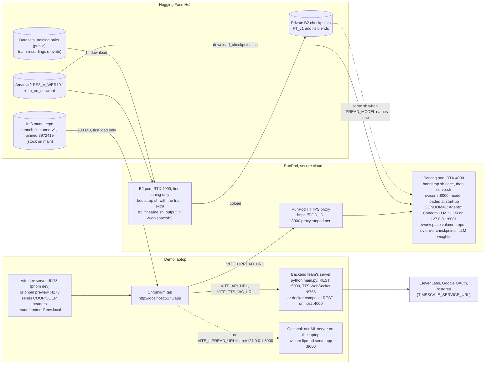

# Deployment

Where each piece runs for the demo, which settings connect them, and the ports involved. The app
runs in Chromium on the demo laptop; Quality reads go to our ML server on a RunPod GPU pod (or to
uvicorn on the laptop); the backend team's server runs on the laptop. The model comes from Hugging
Face and is cached by the browser after the first load; `tokens.json` is fetched on every load.

Without the COOP/COEP headers the page is not cross-origin isolated and onnxruntime-web cannot use
threads; on a 4-core machine one thread took 3.47 s for a read that the app's default of two
threads did in 2.1 s (`frontend/bench/ort-threads/README.md`). Both `pnpm dev` and `pnpm preview`
send the headers (`vite.config.ts`); another static host would have to send them too.

## Frontend settings: `frontend/.env.local`

Vite reads this file when the dev server starts and bakes the values into a build, so restart
`pnpm dev` (or rebuild) after editing it. Nothing secret belongs here.

| Variable | When unset | What it does |
|---|---|---|
| `VITE_LIPREAD_URL` | Quality reads on the device; the share-clips toggle is disabled | Base URL of our ML server, no trailing slash: the pod's proxy URL or `http://127.0.0.1:8000` |
| `VITE_LIPREAD_MODEL_BASE` | The Hugging Face repo at the pinned commit | `/models` serves `public/models/` instead, for offline use (`ml/scripts/publish_frontend_model.sh` copies the files there) |
| `VITE_SKIP_AUTH` | Sign-in required | `1` opens the app without signing in, in `pnpm dev` only (builds ignore it). Signed out means no ElevenLabs voice |
| `VITE_ORT_WEBGPU` | WASM only | `1` tries WebGPU first and falls back to WASM |
| `VITE_CONDOM_URL` | `VITE_LIPREAD_URL` | Server whose `POST /correct` the Agentic Condom calls; neither set → the condom is off |
| `VITE_CONDOM_BUDGET_MS` | 500 ms Normal, 1000 ms Quality | Overrides both condom budgets (evals over a slow link only) |
| `VITE_API_URL` | `http://localhost:5000` | Backend REST API; `http://localhost:4000` when the backend runs in docker compose |
| `VITE_TTS_WS_URL` | `ws://localhost:8765` | Backend TTS WebSocket |
| `VITE_STT_WS_URL` | `VITE_API_URL` as `ws://…/ws/stt` | Backend captions socket |
| `VITE_PHRASES_URL`, `VITE_PHRASES_USER` | Phrase memory stays in the browser (IndexedDB); user `demo` | The TiDB phrase service, once the backend team builds it |

## ML server settings

Read by `ml/src/lipread/` (set them in the pod's environment or before `uvicorn`).

| Variable | Default | What it does |
|---|---|---|
| `LIPREAD_MODEL` | `LRS3_V_WER19.1` | Checkpoint folder under `LIPREAD_CKPT_DIR`, for example a fine-tuned blend |
| `LIPREAD_CKPT_DIR` | `ml/checkpoints` | Where `download_checkpoints.sh` puts the weights and the language model |
| `LIPREAD_DEVICE` | `cuda:0` if available, else `cpu` | |
| `LIPREAD_BEAM_SIZE` | `40` | Beam width for Quality reads |
| `LIPREAD_DECODE` | `greedy` | Default decode for `POST /lipread` only; `/lipread/crops` defaults to beam, and the app asks for beam |
| `LIPREAD_WARM` | `0` (`serve.sh` sets `1`) | Load the model and face detector at start-up instead of on the first request |
| `LIPREAD_MIN_FACE_COVERAGE` | `0.5` | Face-coverage gate for raw clips sent to `POST /lipread` |
| `LIPREAD_PAIRS_DIR` | `data/training_pairs`, relative to where the server runs | Where opted-in training pairs are saved |
| `LIPREAD_PAIRS_REPO` | Unset: pairs stay on disk | Hugging Face dataset to push pairs to; needs `HF_TOKEN` or a logged-in Hugging Face CLI |
| `CORRECTOR_BASE_URL`, `CORRECTOR_MODEL`, `CORRECTOR_API_KEY` | Unset: the condom is off (`/correct` returns the line as read) | The Agentic Condom's LLM (OpenAI-compatible). `serve.sh` with `CONDOM=1` sets the first two to the local vLLM; a key alone defaults the URL to OpenRouter. Keys go in as RunPod secrets, never in the frontend |
| `CONDOM` | `0` | `serve.sh`: `1` starts the condom's vLLM first (`condom.sh`); if it fails, the server starts without it |
| `CONDOM_MODEL`, `CONDOM_GPU_UTIL`, `CONDOM_PORT` | see `.context/agentic-condom.md`, `0.45`, `8001` | `condom.sh`: which model vLLM serves, its share of GPU memory, its port (127.0.0.1 only) |
| `CONDOM_BUDGET_MS_NORMAL`, `CONDOM_BUDGET_MS_QUALITY` | `500`, `1000` | Server-side wait for the LLM per mode |
| `PORT` | `8000` | Port `serve.sh` binds |

## Backend settings

The backend team's file is `backend/.env` (template: `backend/.env.example`). For the demo it needs
`ELEVENLABS_API_KEY`, `GOOGLE_CLIENT_ID` and `GOOGLE_CLIENT_SECRET`, `SESSION_SECRET`,
`TIMESCALE_SERVICE_URL`, and `FRONTEND_ORIGINS` plus `FRONTEND_URL` naming the exact origin the app
is served from (`FRONTEND_ORIGINS` defaults to `http://localhost:5173` and `http://127.0.0.1:5173`,
`FRONTEND_URL` to `http://localhost:5173`).

## Ports

| Port | What | Where |
|---|---|---|
| 5173 | Vite dev server (`pnpm dev`) | Laptop |
| 4173 | `pnpm preview` of a build | Laptop |
| 5000 | Backend REST API, including `/ws/stt` (`python main.py`) | Laptop |
| 4000 | The same API published by `docker compose` (container port 5000) | Laptop |
| 8765 | Backend TTS WebSocket; also the default port of `frontend/bench/ort-threads/serve.py`, so don't run both | Laptop |
| 8000 | Our ML server (uvicorn); on a pod, reached through `https://POD_ID-8000.proxy.runpod.net` | Pod or laptop |
| 8001 | The Agentic Condom's LLM (vLLM, `CONDOM=1`), bound to 127.0.0.1: only the ML server calls it | Pod |
| 8888 | Jupyter on a pod, for sessions without SSH (`ml/runpod/jupyter_exec.py`, D80) | Pod |
| 5300 | Dev server port used by the app eval (`pnpm dev --port 5300`) | Laptop |

## Pods

| Pod | Use | Cost |
|---|---|---|
| Serving pod | Quality reads. ID in the latest handoff (`qa5oi7o7g46n4q` on 2026-10-04); a stopped pod can fail to restart when its host's GPU is taken, then create a new one (D80) | US$0.74/h for a secure RTX 4090 (D32), about CA$1.05/h at 1.4250 CAD per USD (close of 2 October 2026), so about CA$25 a day if left running. Stopped pods still pay for volume storage |
| B2 pod | Fine-tuning only, kept apart from serving (D54, D65: at most 2 pods) | Same rate |
| Condom eval pod | Temporary, 2026-10-04: `condom_eval_pod.sh` as the start command (no SSH or Jupyter needed), candidate LLMs on 8001-8003 with no auth, so stopped right after the eval | Same rate, no volume |

`bootstrap.sh` defaults to `BRANCH=ml/model-pipeline`, which is stale: on a new pod run
`BRANCH=master bash ml/runpod/bootstrap.sh`, then `bash ml/runpod/serve.sh`.

## Source of truth

- `frontend/.env.example`
- `frontend/vite.config.ts`
- `frontend/src/lib/lipreading/modelSpec.ts`
- `frontend/src/lib/lipreading/httpRecognizer.ts`
- `frontend/src/lib/lipreading/onnxRecognizer.ts`
- `frontend/src/lib/lipreading/trainingPairs.ts`
- `frontend/src/lib/agenticCondom/client.ts`
- `frontend/src/lib/backend/config.ts`
- `frontend/src/lib/phrases/store.ts`
- `frontend/src/components/app/require-auth.tsx`
- `frontend/bench/ort-threads/serve.py`
- `ml/runpod/`
- `ml/src/lipread/serve/app.py`
- `ml/src/lipread/model.py`
- `ml/src/lipread/preprocess.py`
- `ml/src/lipread/corrector.py`
- `ml/scripts/download_checkpoints.sh`
- `backend/config.py`
- `backend/.env.example`
- `docker-compose.yml`
