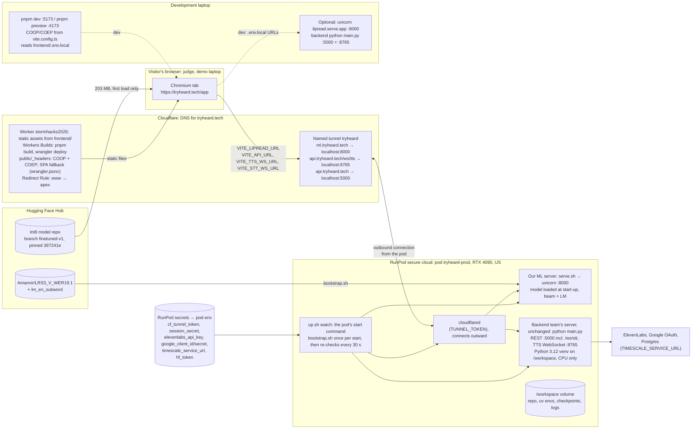

# Deployment

Where each piece runs, which settings connect them, and the ports involved. Production is
https://tryheard.tech: the app is a static build served by Cloudflare Workers (static assets only,
no Worker script); our ML server and the backend
team's server run on one RunPod GPU pod, reached at https://ml.tryheard.tech and
https://api.tryheard.tech through a Cloudflare named tunnel whose connector (cloudflared) runs on
that pod, so `localhost` in its routes is the pod. DNS points at the tunnel, not the pod: a
recreated pod (`ml/runpod/create_pod.sh`, about 3 minutes) keeps every URL. Development is the same
app from `pnpm dev` on a laptop, pointed at a local or hosted server. The model comes from Hugging
Face and is cached by the browser after the first load; `tokens.json` is fetched on every load.
Runbook: `ml/runpod/README-deploy.md`; numbers and decisions D91–D94: `.context/deploy.md`.

Without the COOP/COEP headers the page is not cross-origin isolated and onnxruntime-web cannot use
threads; on a 4-core machine one thread took 3.47 s for a read that the app's default of two
threads did in 2.1 s (`frontend/bench/ort-threads/README.md`). Both `pnpm dev` and `pnpm preview`
send the headers (`vite.config.ts`); in production Cloudflare sends them from `frontend/public/_headers`
on every response, including the SPA fallback for `/app`. There is no `_redirects`: on Cloudflare a
redirect rule wins over `_headers` for the same path, and `/x /index.html 200` turns into a 308 to
`/`; `not_found_handling: "single-page-application"` in `frontend/wrangler.jsonc` serves the client
routes instead. Workers (and Pages) reject files over 25 MiB, so a build without `VITE_ORT_WEBGPU=1` leaves out the WebGPU-only
ORT `.wasm` files (27 and 28 MB) and speed mode loads the plain WASM build (14 MB `.wasm`; same
log-probs, D93).

## Frontend settings: `frontend/.env.local`, or the Worker's build variables

Vite reads `.env.local` when the dev server starts and bakes `VITE_*` values into a build, so
restart `pnpm dev` (or rebuild) after editing it. In production they are the Worker's build
variables (Settings → Build → Variables and secrets), read at build time. Nothing secret belongs in
either. Don't set `VITE_ORT_WEBGPU=1` there: the build then keeps the 27 and 28 MB WebGPU `.wasm`
files and the deploy fails on the 25 MiB limit.

Production (Workers Builds): `VITE_API_URL=https://api.tryheard.tech`,
`VITE_TTS_WS_URL=wss://api.tryheard.tech/ws/tts`, `VITE_STT_WS_URL=wss://api.tryheard.tech/ws/stt`,
`VITE_LIPREAD_URL=https://ml.tryheard.tech`, `NODE_VERSION=22`; never `VITE_SKIP_AUTH`.

| Variable | When unset | What it does |
|---|---|---|
| `VITE_LIPREAD_URL` | Quality reads on the device; the share-clips toggle is disabled | Base URL of our ML server, no trailing slash: the pod's proxy URL or `http://127.0.0.1:8000` |
| `VITE_LIPREAD_MODEL_BASE` | The Hugging Face repo at the pinned commit | `/models` serves `public/models/` instead, for offline use (`ml/scripts/publish_frontend_model.sh` copies the files there) |
| `VITE_SKIP_AUTH` | Sign-in required | `1` opens the app without signing in, in `pnpm dev` only (builds ignore it). Signed out means no ElevenLabs voice |
| `VITE_ORT_WEBGPU` | WASM only | `1` tries WebGPU first and falls back to WASM |
| `VITE_API_URL` | `http://localhost:5000` | Backend REST API; `http://localhost:4000` when the backend runs in docker compose |
| `VITE_TTS_WS_URL` | `ws://localhost:8765` | Backend TTS WebSocket |
| `VITE_STT_WS_URL` | `VITE_API_URL` as `ws://…/ws/stt` | Backend captions socket |
| `VITE_PHRASES_URL`, `VITE_PHRASES_USER` | Phrase memory stays in the browser (IndexedDB); user `demo` | The TiDB phrase service, once the backend team builds it |

## ML server settings

Read by `ml/src/lipread/` (set them in the pod's environment or before `uvicorn`).

| Variable | Default | What it does |
|---|---|---|
| `LIPREAD_MODEL` | `LRS3_V_WER19.1` | Checkpoint folder under `LIPREAD_CKPT_DIR`, for example a fine-tuned blend |
| `LIPREAD_CKPT_DIR` | `ml/checkpoints` | Where `download_checkpoints.sh` puts the weights and the language model |
| `LIPREAD_DEVICE` | `cuda:0` if available, else `cpu` | |
| `LIPREAD_BEAM_SIZE` | `40` | Beam width for Quality reads |
| `LIPREAD_DECODE` | `greedy` | Default decode for `POST /lipread` only; `/lipread/crops` defaults to beam, and the app asks for beam |
| `LIPREAD_WARM` | `0` (`serve.sh` sets `1`) | Load the model and face detector at start-up instead of on the first request |
| `LIPREAD_MIN_FACE_COVERAGE` | `0.5` | Face-coverage gate for raw clips sent to `POST /lipread` |
| `LIPREAD_PAIRS_DIR` | `data/training_pairs`, relative to where the server runs | Where opted-in training pairs are saved |
| `LIPREAD_PAIRS_REPO` | Unset: pairs stay on disk | Hugging Face dataset to push pairs to; needs `HF_TOKEN` or a logged-in Hugging Face CLI. Production: `eschmechel/heard-lipread-pairs` (public) |
| `LIPREAD_SHARED_PHRASES` | `1` | `0` empties `GET /phrases/shared` (the shared phrase bank) without a redeploy |
| `LIPREAD_SHARED_PHRASES_TTL` | `300` | Seconds between background rebuilds of the shared phrase bank (local pairs + the dataset's `pairs/*.json`) |
| `CORRECTOR_BASE_URL`, `CORRECTOR_MODEL`, `CORRECTOR_API_KEY` | Unset: passthrough | LLM corrector hook; unused, the app sends `correct=false` |
| `PORT` | `8000` | Port `serve.sh` binds |

On the production pod these come from the pod env, which `ml/runpod/create_pod.sh` sets (plain
values it is given, secrets as `{{ RUNPOD_SECRET_name }}`); `up.sh` passes them to `serve.sh`.

## Backend settings

The backend team's file is `backend/.env` (template: `backend/.env.example`). For the demo it needs
`ELEVENLABS_API_KEY`, `GOOGLE_CLIENT_ID` and `GOOGLE_CLIENT_SECRET`, `SESSION_SECRET`,
`TIMESCALE_SERVICE_URL`, and `FRONTEND_ORIGINS` plus `FRONTEND_URL` naming the exact origin the app
is served from (`FRONTEND_ORIGINS` defaults to `http://localhost:5173` and `http://127.0.0.1:5173`,
`FRONTEND_URL` to `http://localhost:5173`).

In production there is no `backend/.env`: the secrets come from RunPod secrets through the pod env,
and `up.sh` sets `FRONTEND_URL=https://tryheard.tech`, `FRONTEND_ORIGINS=https://tryheard.tech` and
`SESSION_HTTPS_ONLY=true` (the word `true`: `backend/config.py` compares against it). Google
sign-in needs `https://api.tryheard.tech/api/auth/google/callback` among the OAuth client's
authorised redirect URIs. The session cookie is host-only on `api.tryheard.tech` and
`SameSite=Lax`; `tryheard.tech` is the same site, so `fetch(..., {credentials: "include"})` and
both WebSockets carry it, which is why the TTS socket is a path on `api.` and not its own hostname.

## Ports

| Port | What | Where |
|---|---|---|
| 5173 | Vite dev server (`pnpm dev`) | Laptop |
| 4173 | `pnpm preview` of a build | Laptop |
| 5000 | Backend REST API, including `/ws/stt` (`python main.py`) | Laptop |
| 4000 | The same API published by `docker compose` (container port 5000) | Laptop |
| 8765 | Backend TTS WebSocket; also the default port of `frontend/bench/ort-threads/serve.py`, so don't run both | Laptop |
| 8000 | Our ML server (uvicorn); on a pod, reached through `https://POD_ID-8000.proxy.runpod.net` | Pod or laptop |
| 8888 | Jupyter on a pod, for sessions without SSH (`ml/runpod/jupyter_exec.py`, D80) | Pod |
| 5300 | Dev server port used by the app eval (`pnpm dev --port 5300`) | Laptop |
| 20241 | cloudflared metrics, `/ready` (127.0.0.1 only) | Production pod |
| 443 | `tryheard.tech`, `ml.`, `api.` (Cloudflare) | Public |

## Pods

| Pod | Use | Cost |
|---|---|---|
| Production pod | ML server + backend + cloudflared, all started by `up.sh` (`tryheard-prod`, `vh5w7ghb84dpce` on 2026-10-04, US). Recreate: `bash ml/runpod/create_pod.sh`; a stopped pod can fail to restart when its host's GPU is taken, so recreate rather than wait (D80) | US$0.74/h for a secure RTX 4090 (D32), about CA$1.05/h at 1.4250 CAD per USD (close of 2 October 2026), so about CA$25 a day if left running. Stopped pods still pay for volume storage |
| Standby (judging window only) | A second pod from the same command (`NAME=tryheard-standby`) joins the tunnel as a replica (D94) | Same rate, while it runs |
| Earlier Quality pod | `qa5oi7o7g46n4q` (Romania), reached only through its RunPod proxy URL; not behind the tunnel | Same rate |
| B2 pod | Fine-tuning only, kept apart from serving (D54, D65: at most 2 pods running) | Same rate |

`create_pod.sh` and `up.sh` take `BRANCH` (default `master`) for the code the pod checks out.

## Source of truth

- `frontend/.env.example`
- `frontend/vite.config.ts`
- `frontend/src/lib/lipreading/modelSpec.ts`
- `frontend/src/lib/lipreading/httpRecognizer.ts`
- `frontend/src/lib/lipreading/onnxRecognizer.ts`
- `frontend/src/lib/lipreading/trainingPairs.ts`
- `frontend/src/lib/backend/config.ts`
- `frontend/src/lib/phrases/store.ts`
- `frontend/src/components/app/require-auth.tsx`
- `frontend/bench/ort-threads/serve.py`
- `ml/runpod/`
- `ml/src/lipread/serve/app.py`
- `ml/src/lipread/model.py`
- `ml/src/lipread/preprocess.py`
- `ml/src/lipread/corrector.py`
- `ml/scripts/download_checkpoints.sh`
- `backend/config.py`
- `backend/.env.example`
- `docker-compose.yml`
- `backend/Dockerfile`
- `frontend/public/_headers`
- `frontend/wrangler.jsonc`
- `scripts/check_live.sh`
