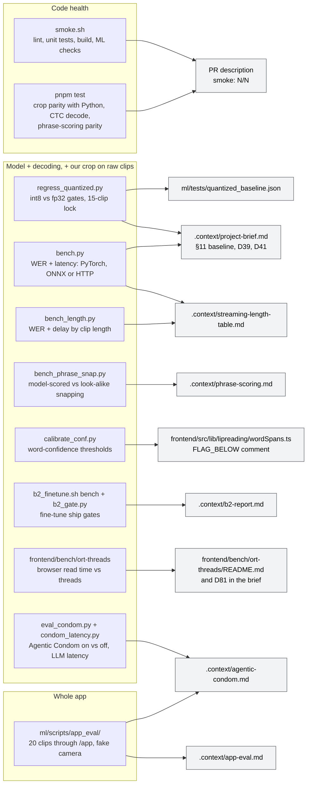

# Evaluation: what each check measures

Each check, the part of the system it exercises, and the file its numbers are recorded in. Read
the layer before comparing numbers: LRS3-100 uses pre-made mouth crops, so it measures the model
and decoder but not our crop (D33); the raw-face clips add our crop pipeline; only the app eval
adds capture, sentence cutting and phrase memory. No number here comes from a live webcam.

## The checks

| Check | What it measures | Data | Pass rule | Numbers |
|---|---|---|---|---|
| `./smoke.sh` | Frontend install, lint, unit tests, build; ML environment sync and `ml/scripts/smoke_checks.py`: imports, 30→25 fps resample, faceless clip rejected, model load + greedy decode, ONNX parity, `/health`, `/lipread/crops`, a real-face clip end to end, `/training-pairs`, the Agentic Condom (gate, failure paths and `/correct` with a fake LLM), quantized regression (fast) | Synthetic clips; checks that need a checkpoint, an exported model or `ml/data/smoke/face.mp4` print SKIP without them | Every step passes; report `smoke: N/N` | The PR description |
| `pnpm test` (vitest) | Crop parity with Python (bit-exact on the synthetic fixture), greedy CTC decode, phrase scoring against sentencepiece and torch `ctc_loss` (665 texts), recognizers; `LIPREAD_ONNX_TEST=1` adds the real-model golden test | Committed fixtures | All pass | Test output |
| `ml/scripts/regress_quantized.py` | The int8 model against the fp32 export on identical inputs, greedy decode | 100 LRS3 test clips (pre-made crops) + 20 raw face clips in `ml/data/raw_eval`; `--fast` uses 5 + 2 and runs in smoke | Size ≤ 220 MB, WER ≤ fp32 + 1.0 point per set, frame agreement ≥ 0.95, no new empty outputs, a 250-frame input runs; lock: same sha256 and exact texts for 15 clips | `ml/tests/quantized_baseline.json`; D39 and D41; re-run on 2026-10-04: 13/13 gates, 15/15 texts identical (`.context/app-eval.md`) |
| `ml/scripts/bench.py` | WER (jiwer) and per-stage latency for in-process PyTorch, ONNX Runtime, or the HTTP service (mp4 or crops transport) | LRS3-100 or a folder of raw clips | Measurement only | `.context/project-brief.md` §11, `.context/streaming-length-table.md` |
| `ml/scripts/bench_length.py` | WER and delay for 2–20 s clips: native ONNX Runtime, plus the pod's beam with `--url` | Consecutive LRS3 test clips joined end to end | Measurement only | `.context/streaming-length-table.md` |
| `ml/scripts/bench_phrase_snap.py` | Snapping to saved phrases: model margin against look-alike, with and without near-duplicate decoys | LRS3 test clips 100–399 | Measurement only | `.context/phrase-scoring.md` |
| `ml/scripts/calibrate_conf.py` | How many wrong words each confidence threshold boxes, and how many right ones | Raw clips + LRS3, int8 greedy and PyTorch beam | Chose 0.6 for the boxes | Comment on `FLAG_BELOW` in `wordSpans.ts` |
| `ml/scripts/app_eval/` | The whole app in headless Chromium: capture, sentence cutting, phrase memory, per mode | The 20 raw clips joined into one 640×480, 30 fps video (122 words) played as the camera | Measurement; compare with the model alone on the same clips (25.4% on-device greedy, 29.5% pod beam) | `.context/app-eval.md` |
| `ml/runpod/b2_finetune.sh` (bench step) + `ml/scripts/b2_gate.py` | Stock 19.1 against each fine-tuned blend, greedy and beam | LRS3-100 + the held-out speaker, + eval v2 when benched | Held-out greedy at least 3 points better and LRS3-100 greedy at most 2.0 points worse (D74); eval v2 greedy at most 2.0 points worse (D90) | `.context/b2-report.md` |
| `frontend/bench/ort-threads/` | Browser read time for a 2.8 s input at different ORT thread counts | Random input, int8 model | Measurement only | Its `README.md`, D81 |
| `ml/scripts/eval_condom.py` | The Agentic Condom on vs off on the same readings: WER, lines changed, lines where it changed a word the reader had right | Pod readings (greedy and beam) of raw_eval and LRS3-100; no phrases or conversation (cold start) | Ship on by default only if words wrong drop on raw_eval and the app eval and fewer than 2% of lines get a right word changed | `.context/agentic-condom.md` |
| `ml/scripts/condom_latency.py` | The condom's LLM call time with its real prompts | 20 built-in sentences, on the pod (no network) | Measurement only (the budgets are 500 ms / 1 s) | `.context/agentic-condom.md` |

## Gaps

- No live webcam test: the app eval plays recorded clips through a fake camera.
- The raw-face set is small: 20 clips, 122 words, so one word is 0.82 points, and app-eval runs on
  the same code vary by about 2 points.
- 6 of the 20 raw clips are GRID commands, where beam + LM is worse than greedy; compare modes on
  the 14 natural sentences too (`.context/streaming-length-table.md`).
- The app-eval sentences repeat, which favours phrase memory (`.context/app-eval.md`).
- The regression suite's long-input probe is 250 frames (10 s). Quality's on-device fallback can
  send up to 500 frames (20 s); the trimmed position table holds 500, and `bench_length.py`'s 20 s
  row ran inputs of 425–500 frames once, but no automated gate covers that length.
- The backend team's captions, diarization and TTS have their own tests in `backend/tests/`, not
  covered here.

## Source of truth

- `smoke.sh`
- `ml/scripts/smoke_checks.py`
- `ml/scripts/regress_quantized.py`
- `ml/tests/`
- `ml/scripts/bench.py`
- `ml/scripts/bench_length.py`
- `ml/scripts/bench_phrase_snap.py`
- `ml/scripts/calibrate_conf.py`
- `ml/scripts/app_eval/`
- `ml/scripts/eval_condom.py`
- `ml/scripts/condom_latency.py`
- `ml/runpod/b2_finetune.sh`
- `ml/scripts/b2_gate.py`
- `ml/runpod/bench_baseline.sh`
- `frontend/bench/ort-threads/`
- `frontend/package.json`
- `frontend/src/lib/lipreading/crop/parity.test.ts`
- `frontend/src/lib/lipreading/onnxRecognizer.golden.test.ts`
- `frontend/src/lib/phrases/ctcScore.test.ts`
- `frontend/src/lib/lipreading/wordSpans.ts`
