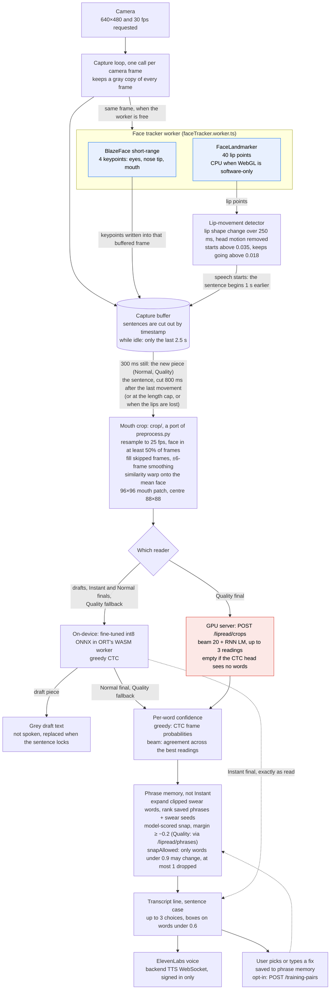

# Lip-reading pipeline

What happens between the camera and the spoken sentence, inside `useLipReader.ts`. Everything up
to the read runs in the browser; the read runs on the device, or on our GPU server for Quality's
final pass. Instant mode skips phrase memory, choices and boxes: its line goes in exactly as read.
Timing per mode is in [modes.md](modes.md); the numbers in the boxes are listed with their source
below the diagram.

If the worker can't start, both trackers run on the main thread instead: BlazeFace on every frame
and FaceLandmarker on every 3rd frame (`LIP_TRACKING_STRIDE`). In the worker, FaceLandmarker skips
MediaPipe's GPU mode when WebGL is a software rasterizer, where it was 6 times slower (D83). Frames the worker skipped while busy
have no keypoints; the crop fills them in by interpolation, the same as the Python pipeline.

## Numbers in this diagram

| What | Value | Defined in |
|---|---|---|
| Camera request | 640×480 at 30 fps, as "ideal" values, so slower webcams still open | `faceQuality.ts` (`CAMERA_CONSTRAINTS`) |
| Movement bars | deformation over a fixed 250 ms span; start above 0.035, keep going above 0.018; smoothing 0.6 per 250 ms | `useLipReader.ts` (`ACTIVITY_SPAN_MS`, `ACTIVITY_START`, `ACTIVITY_KEEP`, `ACTIVITY_EMA`), D84 |
| Lead-in before detected movement | 1 s | `useLipReader.ts` (`LEAD_MS`) |
| Buffer kept while idle | 2.5 s | `useLipReader.ts` (`IDLE_KEEP_MS`) |
| Draft pause, lock pause | 300 ms, 800 ms; a sentence ends at its last movement + 800 ms | `modes.ts` (`SHORT_PAUSE_MS`, `LONG_PAUSE_MS`), D82 |
| Lips lost, sentence ends | 1.5 s of tracked time; 5 s with no tracker answer | `useLipReader.ts` (`LIPS_GONE_MS`, `TRACKER_SILENT_MS`), D85 |
| Sentence length cap | Instant 10 s, Normal 6 s, Quality 20 s, counted on the tracker's clock; at the cap a sentence continues only if still mid-speech (quiet ≤ 300 ms) | `modes.ts` (`maxSeconds`), D85; D67 in `.context/streaming-plan.md` set Normal's and Quality's (its Instant value, 2 s, predates the code's 10 s) |
| Shortest read | 0.5 s | `modelSpec.ts` (`minSeconds`), `serve/app.py` (`MIN_SECONDS`) |
| Face coverage gate | a face in at least 50% of frames | `crop/index.ts`, `preprocess.py` (D30) |
| Keypoint smoothing | ±6 frames | `crop/keypoints.ts` (`smoothKeypoints`) |
| Crop | 96×96 patch of the 256×256 aligned face, centre 88×88, then (x / 255 − 0.421) / 0.165 | `crop/warp.ts`, `crop/modelInput.ts`, `preprocess.py` |
| On-device model | fine-tuned `FT_v1` (WiSE-FT α 0.5), int8 `dyn-pw8-rn16`, 203 MB; `video [1, 1, T, 88, 88]` → `log_probs [T, 5049]`, T ≤ 500 frames | `modelSpec.ts` (HF branch `finetuned-v1`), `quantize_onnx.py`, D39, D88 |
| Server decode | stock weights unless `LIPREAD_MODEL` is set; beam 20, CTC weight 0.1, language model weight 0.2 | `model.py` (`DEFAULT_BEAM`), `serve/app.py`, D88, D90 |
| Server request timeout | 10 s + 1 s per second of video | `httpRecognizer.ts` |
| Beam word confidence | share of up to 10 distinct readings that keep the word, softmax temperature 2.0 | `model.py` (`nbest_words`, `BEAM_CONF_TEMPERATURE`) |
| Box on a word | confidence below 0.6 | `wordSpans.ts` (`FLAG_BELOW`) |
| Snap gate | every word a saved phrase would change is below 0.9, or has no confidence; at most 1 word of the reading dropped | `wordSpans.ts` (`SURE_ABOVE`, `MAX_SNAP_DROPS`, `snapAllowed`), D86 |
| Look-alike snap | similarity ≥ 0.75 (swear seeds, and Quality reads when `/lipread/phrases` fails) | `phrases/snap.ts` (`SNAP_THRESHOLD`) |
| Model-scored snap | margin ≥ −0.2, the user's own phrases only: on the device, or for Quality reads on the server (`POST /lipread/phrases`) | `phrases/ctcScore.ts` (`MODEL_SNAP_MARGIN`), `ml/src/lipread/phrases.py` |

## Source of truth

- `frontend/src/hooks/useLipReader.ts`
- `frontend/src/lib/lipreading/modes.ts`
- `frontend/src/lib/lipreading/faceTracker.ts`
- `frontend/src/lib/lipreading/faceTracker.worker.ts`
- `frontend/src/lib/lipreading/faceDetector.ts`
- `frontend/src/lib/lipreading/faceLandmarker.ts`
- `frontend/src/lib/lipreading/faceQuality.ts`
- `frontend/src/lib/lipreading/crop/`
- `frontend/src/lib/lipreading/onnxRecognizer.ts`
- `frontend/src/lib/lipreading/httpRecognizer.ts`
- `frontend/src/lib/lipreading/ctc.ts`
- `frontend/src/lib/lipreading/wordSpans.ts`
- `frontend/src/lib/lipreading/modelSpec.ts`
- `frontend/src/lib/phrases/`
- `frontend/src/components/app/self-transcript.tsx`
- `ml/src/lipread/preprocess.py`
- `ml/src/lipread/model.py`
- `ml/src/lipread/phrases.py`
- `ml/src/lipread/serve/app.py`
