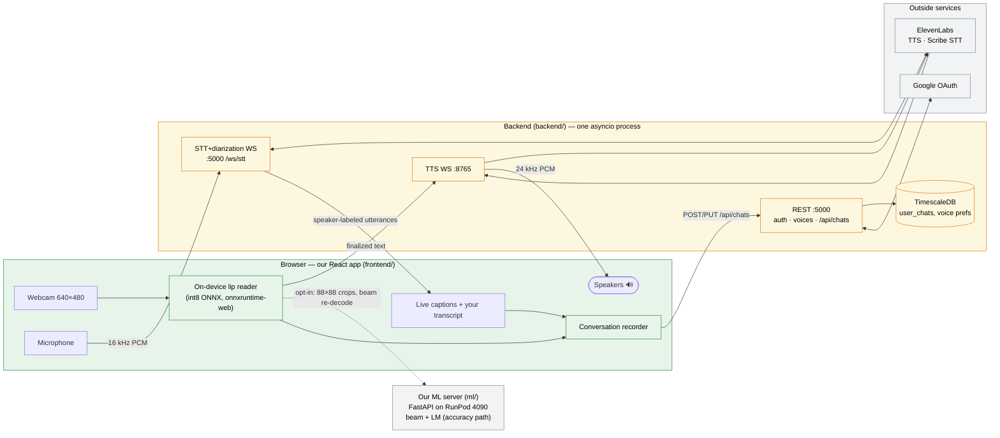
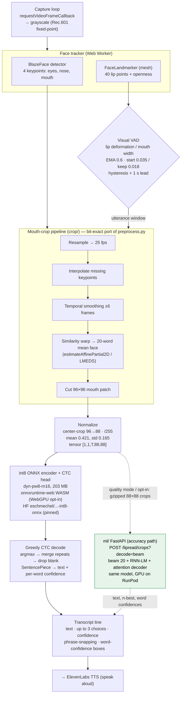
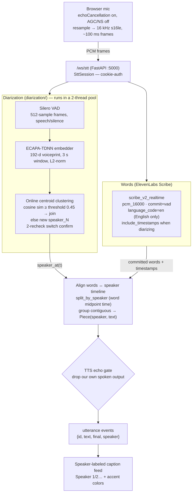
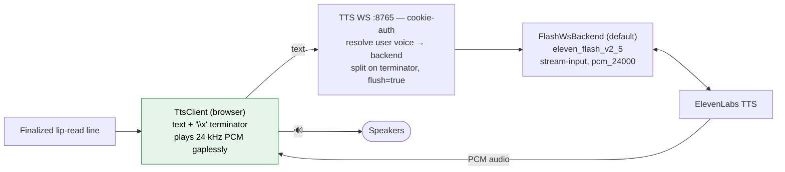
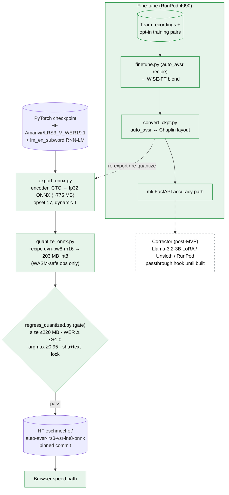

# ML mechanisms — how *heard* works

A mechanism-level view of the three ML pipelines behind the app, plus the model build/train
pipeline that feeds them. Green = ours (`frontend/`, `ml/`); yellow = backend team (`backend/`);
grey = outside services. Dashed = planned / optional / opt-in.

---

## 1. System overview — the two live flows

*heard* runs two independent real-time loops at once:

- **You → voice** (silent speech): you mouth words at the webcam, the browser lip-reads them
  on-device, and ElevenLabs speaks the text aloud in your chosen voice.
- **Them → captions** (listening): the mic streams to the server, which transcribes *and*
  diarizes nearby speech into speaker-labeled captions. A toggle can pause this.

Everything the two loops produce is recorded, message-by-message, into a conversation in Timescale.

---

## 2. Lip-reading pipeline (visual speech recognition)

The whole read happens **in the browser** — no camera video ever leaves the device. Face tracking
runs in a Web Worker so the capture loop never stalls; a **visual VAD** (lip *deformation*, head
motion removed) decides when an utterance starts and stops, so it's streaming, not push-to-talk.
The crop is a bit-exact port of the Python training preprocessing, so the ONNX model sees exactly
what it was trained on.

**Two tiers, one model.** Speed path = int8 ONNX + greedy CTC in the browser. Accuracy path =
the *same* Auto-AVSR encoder/CTC in PyTorch on the server, but decoded with beam search + RNN-LM +
the attention decoder (none of which are in the ONNX graph). I/O, tokens (`unigram5000`, 5049), and
preprocessing are kept byte-identical so the two are interchangeable.

---

## 3. Listening pipeline (STT + diarization)

The mic streams 16 kHz PCM to one WebSocket (`/ws/stt`). The server fans it to **two** consumers in
parallel: ElevenLabs Scribe for the words, and our diarizer for *who said them*. Word-level
timestamps from Scribe are aligned against the diarizer's speaker timeline to split each committed
transcript into per-speaker pieces. Diarization is feature-gated (`DIARIZATION=1`); when off, the
captions still work, just without speaker labels.

**Live config** (deployed `.env`): Silero VAD + ECAPA-TDNN, cosine threshold `0.45`, 3 s voiceprint
window, 2 s min speech, 0.8 s hangover. Speaker centroids adapt over time (running weighted average)
so a voice keeps matching as it drifts.

---

## 4. Text-to-speech path (speaking your words)

A dedicated raw-WebSocket server on `:8765`. Each finalized lip-read line is sent as text + a
`\x` terminator that flushes it to ElevenLabs; audio streams back as 24 kHz PCM and plays gaplessly
via Web Audio. The voice is resolved from the user's saved preference at connect time.

---

## 5. Model build & training pipeline (offline)

How the browser's int8 model and the server's fine-tuned checkpoints are produced. The int8 export
is gated by a regression test (WER delta, argmax agreement, a sha + exact-text lock) before it can
ship. The **LLM corrector** (Llama-3.2-3B LoRA via Unsloth) is a *passthrough hook* today — the
plumbing exists, the fine-tuned model is post-MVP.

---

## Source of truth

- `frontend/src/hooks/useLipReader.ts`
- `frontend/src/lib/lipreading/`
- `frontend/src/lib/listening/`
- `frontend/src/lib/backend/`
- `frontend/src/hooks/useConversationRecorder.ts`
- `backend/main.py`
- `backend/websocket_server.py`
- `backend/api/`
- `backend/stt/`
- `backend/diarization/`
- `backend/tts/`
- `ml/src/lipread/`
- `ml/scripts/`
- `ml/runpod/`
