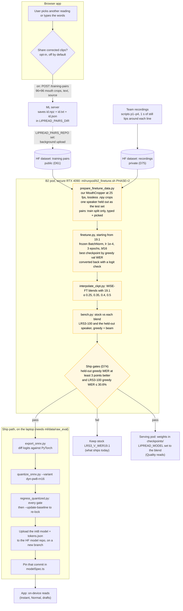

# Training loop: from user fixes to a new model

How corrected clips and team recordings could become a new model in the app. The pipeline is
built and has run end to end on a GPU pod (Phase 1, on LRS3 test clips) and on a public rehearsal
(GRID), but Phase 2 on the team's own recordings has not run (`.context/b2-report.md`), so the app
still ships the stock `LRS3_V_WER19.1` weights. A model ships only if it passes both gates.

The yellow steps have run on LRS3 clips (Phase 1) and on GRID, never on team recordings.

## What the rehearsal showed (GRID, `.context/b2-report.md`)

| Model | LRS3-100 greedy WER | GRID held-out greedy WER |
|---|---|---|
| Stock 19.1 | 28.6% | 73.3% |
| Plain fine-tune, lr 1e-4, 5 epochs | 70.8% | 10.2% |
| Frozen BatchNorm, lr 1e-4, 3 epochs | 38.0% | 9.0% |
| Frozen BatchNorm, then WiSE-FT α 0.4 | 29.7% | 32.7% |

Plain fine-tuning forgot open speech (LRS3-100 went from 28.6% to 70.8% wrong). Keeping 19.1's
BatchNorm statistics and blending back towards the stock weights kept most of the gain on unseen
GRID speakers for +1.1 points on LRS3-100. GRID has a fixed six-word grammar, so its gain is mostly
vocabulary; expect much less on real speech, and GRID-tuned weights never ship (D79). α was chosen
by looking at LRS3-100 itself, so the +1.1 is slightly optimistic (D74).

## Source of truth

- `frontend/src/lib/lipreading/trainingPairs.ts`
- `frontend/src/hooks/useLipReader.ts`
- `frontend/src/components/app/lip-mode-menu.tsx`
- `frontend/src/lib/lipreading/modelSpec.ts`
- `ml/src/lipread/serve/app.py`
- `ml/src/lipread/model.py`
- `ml/runpod/b2_finetune.sh`
- `ml/runpod/bootstrap.sh`
- `ml/scripts/prepare_finetune_data.py`
- `ml/scripts/finetune.py`
- `ml/scripts/interpolate_ckpt.py`
- `ml/scripts/convert_ckpt.py`
- `ml/scripts/bench.py`
- `ml/scripts/export_onnx.py`
- `ml/scripts/quantize_onnx.py`
- `ml/scripts/regress_quantized.py`
- `ml/scripts/publish_frontend_model.sh`
- `ml/tests/quantized_baseline.json`
