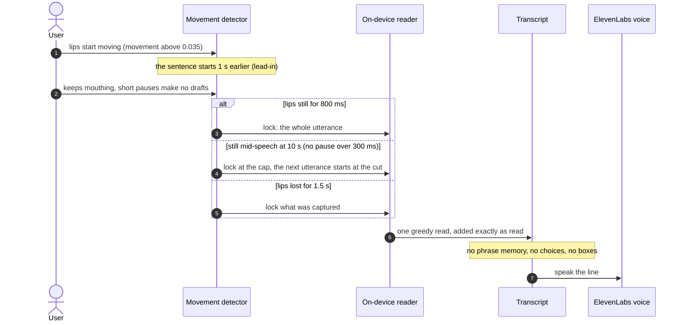
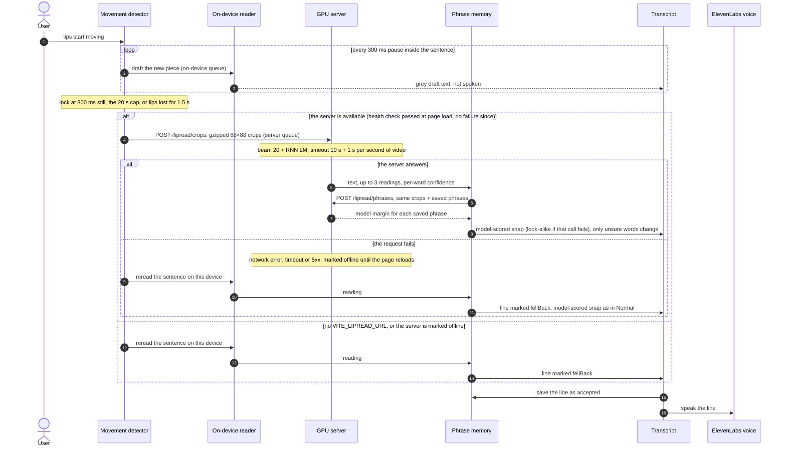

# Modes: Instant, Normal, Quality

How one sentence is cut and read in each mode the user can pick (`modes.ts`; Normal is the
default). All three lock a sentence after 800 ms of still lips and cut it at the last movement plus
800 ms (later frames become the next sentence's lead-in); they differ in drafts, length cap and where
the final read runs. Two queues keep them apart: on-device reads run one at a time, and
server reads have their own queue, so a slow server never holds up the drafts.

## Instant

## Normal

## Quality

An empty reading (the beam returns nothing when the CTC head sees no words) or a clip without a
face adds no line, and the device does not reread it. The app checks `/health` once, when the page
loads: after the pod is started or restarted, reload the page to use it again. `/app` shows neither
the `fellBack` flag (only `/lab` does) nor a server failure after load: the mode menu's "Server
offline" reflects the page-load check only.

## Side by side

| | Instant | Normal | Quality |
|---|---|---|---|
| Drafts while talking | no | each 300 ms pause, new piece only | each 300 ms pause, new piece only |
| Sentence locks at | 800 ms still, 10 s, or lips lost 1.5 s | 800 ms still, 6 s, or lips lost 1.5 s | 800 ms still, 20 s, or lips lost 1.5 s |
| Final read | none: the one read is final | whole sentence again, on the device | whole sentence on the GPU server; on the device if that fails |
| Phrase memory, choices, boxes | no | yes, model-scored on the device | yes, model-scored on the server (look-alike if that call fails) |
| Model | fine-tuned int8 on the device | fine-tuned int8 on the device | stock weights on the server (beam 20, LM 0.2) |
| Words wrong, app test (20 strangers' clips, shipped models, two runs) | 30.0% | 27.0% | 25.8% |
| Words wrong, model alone on 62 unseen people (eval v2, stock) | 41.3% (greedy) | 41.3% (greedy) | 35.0% (beam) |
| Time to text after a 3 s sentence | about 1.9 s | about 1.9 s | about 2.2 s; 2.8 s or more with phrase scoring |

Runs of the same model on the 20-clip app test differ by up to 8 points, so small gaps between
modes are noise. Quality keeps the stock weights because the fine-tuned ones made the beam search
worse on strangers (app test 25.8% → 28.7%, LRS3-100 beam 22.6% → 24.4%). Most of the time to text
is the 800 ms pause plus the read itself (about 1.1 s in the browser, 0.82 s for the beam on the
GPU); phrase scoring in Quality uploads the crops a second time. Sources: `.context/b2-report.md`,
`.context/eval-v2.md`, `.context/app-eval.md`.

## Source of truth

- `frontend/src/lib/lipreading/modes.ts`
- `frontend/src/hooks/useLipReader.ts`
- `frontend/src/lib/lipreading/createRecognizers.ts`
- `frontend/src/lib/lipreading/httpRecognizer.ts`
- `frontend/src/lib/lipreading/onnxRecognizer.ts`
- `frontend/src/lib/lipreading/wordSpans.ts`
- `frontend/src/components/app/lip-mode-menu.tsx`
- `ml/src/lipread/serve/app.py`
- `ml/src/lipread/model.py`
- `ml/src/lipread/phrases.py`
