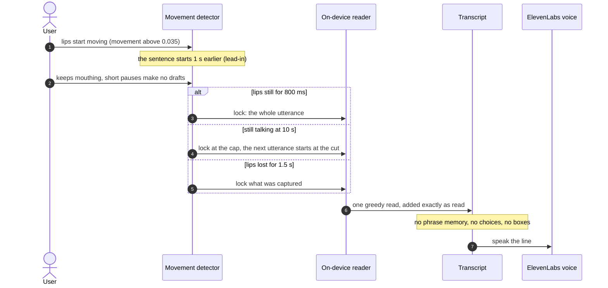
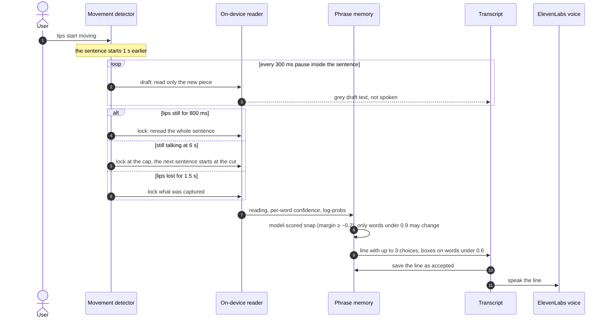
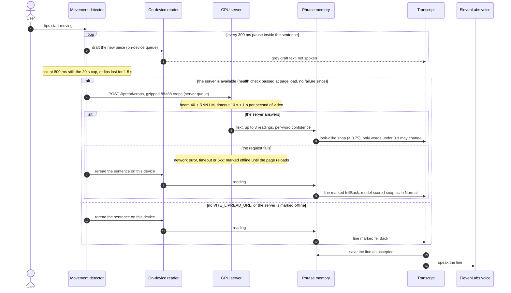

# Modes: Instant, Normal, Quality

How one sentence is cut and read in each mode the user can pick (`modes.ts`; Normal is the
default). All three lock a sentence after 800 ms of still lips; they differ in drafts, length cap
and where the final read runs. Two queues keep them apart: on-device reads run one at a time, and
server reads have their own queue, so a slow server never holds up the drafts.

## Instant

## Normal

## Quality

An empty reading (the beam returns nothing when the CTC head sees no words) or a clip without a
face adds no line, and the device does not reread it. The app checks `/health` once, when the page
loads: after the pod is started or restarted, reload the page to use it again.

## Side by side

| | Instant | Normal | Quality |
|---|---|---|---|
| Drafts while talking | no | each 300 ms pause, new piece only | each 300 ms pause, new piece only |
| Sentence locks at | 800 ms still, 10 s, or lips lost 1.5 s | 800 ms still, 6 s, or lips lost 1.5 s | 800 ms still, 20 s, or lips lost 1.5 s |
| Final read | none: the one read is final | whole sentence again, on the device | whole sentence on the GPU server; on the device if that fails |
| Phrase memory, choices, boxes | no | yes, model-scored snap | yes, look-alike snap (model-scored after a fallback) |
| Words wrong, app eval (20 real-face clips, 122 words) | 29.5% | ≈23% over 4 runs (18.9–27.0%) with model-scored snapping; 28.7% before it | 30.3% |
| Words wrong, model alone on the same clips | 25.4% | 25.4% | 29.5% |
| Read time | browser ≈ 0.36 s per second of video | same, plus the draft reads | round trip 1.4 s p50, 2.5 s p95 (same 20 clips, laptop to pod) |

The app-eval sentences repeat ("kids/dogs by the door" three times), which is exactly what phrase
memory helps with, so expect less gain on everyday speech. Runs vary by about 2 points. On the 20
clips Quality is worse than the model alone on the device because 6 of them are GRID commands
("bin blue at f two now") that the language model pulls towards ordinary English; on the 14 natural
sentences beam was better on 4 and worse on none, and on 100 LRS3 test clips it scores 22.6% against
28.5% for on-device greedy. Sources: `.context/app-eval.md`, `.context/streaming-length-table.md`.

## Source of truth

- `frontend/src/lib/lipreading/modes.ts`
- `frontend/src/hooks/useLipReader.ts`
- `frontend/src/lib/lipreading/createRecognizers.ts`
- `frontend/src/lib/lipreading/httpRecognizer.ts`
- `frontend/src/lib/lipreading/onnxRecognizer.ts`
- `frontend/src/components/app/lip-mode-menu.tsx`
- `ml/src/lipread/serve/app.py`
- `ml/src/lipread/model.py`
