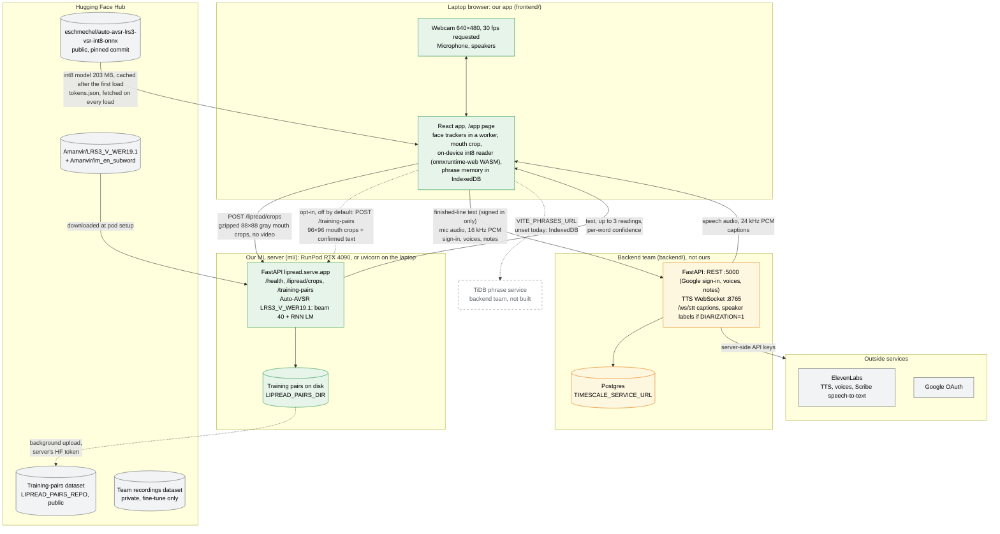

# System

The whole system as it runs for the demo. The browser does the camera work, face tracking, mouth
crop and the on-device read, and no camera video leaves it: Quality reads and opted-in training
pairs send grayscale mouth crops only. Green is ours (`frontend/`, `ml/`), yellow is the backend
team's (`backend/`), grey is outside services. A dashed box is planned but not built; a dashed arrow
is optional (opt-in, or only when configured).

## What crosses the network

| From → to | What | When |
|---|---|---|
| Hugging Face → browser | `lipread_ctc.int8.onnx` (203 MB), from a pinned commit | First load only; after that the browser's Cache Storage (`lipread-models-v1`) |
| Hugging Face → browser | `tokens.json` (78 KB), same commit | Every page load: the app does not cache it |
| Browser → ML server | `GET /health` | Once at page load (5 s timeout); the app does not re-check later |
| Browser → ML server | `POST /lipread/crops`: t × 88 × 88 uint8 gray mouth crops, gzipped | Each Quality sentence when it locks |
| ML server → browser | `text`, up to 3 `alternatives`, per-word confidence (`words`), `latency_ms` | Reply to the above |
| Browser → ML server | `POST /training-pairs`: t × 96 × 96 mouth crops + the confirmed text | Only with the opt-in on, when the user picks or types a fix |
| ML server → Hugging Face | The pair as `id.npz` + `id.txt` + `id.json` | Only if `LIPREAD_PAIRS_REPO` is set on the server |
| Browser → backend | Text of each finished line over the TTS WebSocket | Signed in and not muted |
| Backend → browser | 24 kHz 16-bit mono PCM | Reply to the above |
| Browser → backend | Microphone audio, 16 kHz 16-bit mono PCM in ~100 ms frames, over `/ws/stt` | While the listening panel runs |
| Backend → ElevenLabs | Text to speak, audio to transcribe, voice list | API key stays on the backend |
| Browser → TiDB phrase service | Phrase search and saves | Not built: needs the backend team's service and `VITE_PHRASES_URL` |

## Source of truth

- `frontend/src/pages/app-page.tsx`
- `frontend/src/hooks/useLipReader.ts`
- `frontend/src/lib/lipreading/createRecognizers.ts`
- `frontend/src/lib/lipreading/onnxRecognizer.ts`
- `frontend/src/lib/lipreading/httpRecognizer.ts`
- `frontend/src/lib/lipreading/modelSpec.ts`
- `frontend/src/lib/lipreading/trainingPairs.ts`
- `frontend/src/lib/lipreading/faceTracker.worker.ts`
- `frontend/src/lib/lipreading/faceQuality.ts`
- `frontend/src/lib/phrases/store.ts`
- `frontend/src/lib/backend/config.ts`
- `frontend/src/lib/backend/tts.ts`
- `frontend/src/lib/listening/sttEngine.ts`
- `ml/src/lipread/serve/app.py`
- `ml/src/lipread/model.py`
- `ml/scripts/download_checkpoints.sh`
- `backend/main.py`
- `backend/config.py`
- `backend/websocket_server.py`
- `backend/api/stt.py`
